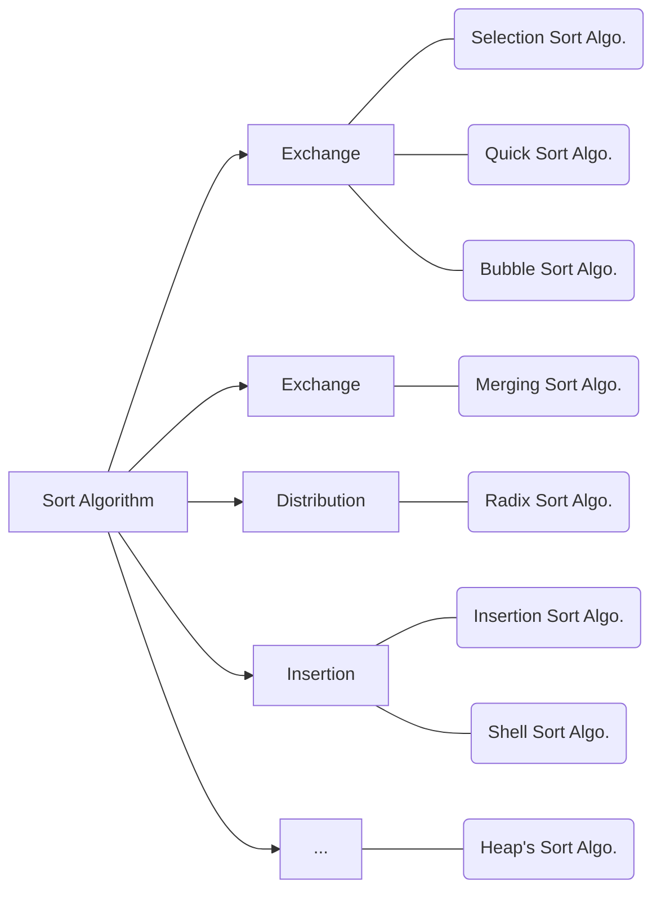

# 정렬 알고리즘

## 정렬의 개념

**Key**: 자료를 정렬하는 데 사용하는 자료의 값

예를 들어, 파일의 크기에 따라 파일을 정렬한 경우 정렬에 사용한 자료의 값(**key**)이 **파일의 크기**입니다.

**Sort Order**: descending/ascending sort

정렬 알고리즘의 평가 기준은 **효율성**과 **안정성**입니다.

1. **efficiency of sort**: 얼마만큼 빠르게 정렬하는가
2. **stability of sort**: 키 값이 같은 자료들이 입력한 순서를 그대로 정렬하는가

먼저 정렬의 효율성에 관해서 예를 들면, 정렬 대상이 되는 자료가 n개라고 가정해봅시다. 이렇게 정렬 대상의 개수를 n개로 정해 놓았을 때 얼마만큼 많은 연산을 실행하는지를 기준으로 효율성을 판단합니다. 대부분의 정렬 알고리즘은 키 값을 비료하는 비교 연산과 자료의 위치를 바꾸는 이동 연산으로 이루어집니다. 따라서 비교 연산의 횟수와 이동 연산의 횟수로 정렬의 효율성을 판단합니다. 참고로 현재 가장 효율이 우수한 정렬 아로기즘 중 하나인 **quick sort**는 수행속도가 $O(n \log n)$인데 비해, 다른 여러 정렬 알고리즘은 수행 속도가 $O(n^2)$입니다.

연산의 횟수가 같다 하더라도 알고리즘에 따라 비교 연산을 많이 수행하는 경우와 자료 이동의 연산을 많이 수행하는 경우로 나눌 수 있습니다. 정렬을 수행해야 하는 자료의 크기가 크다면 이동 연산이 적을수록 좋습니다. 왜냐하면, 자료의 크기가 크면 그만큼 이동해야 하는 데이터의 크기가 증가하여 이동 연산을 수행하는 데 더 많은 시간이 필요하기 때문입니다.

다음 정렬의 안정성의 예를 들면, 자료의 파일 크기로 정렬한다고 가정해봅시다. (파일 크기, 파일 이름)으로 자료가 저장 되어 있습니다.

| 파일 크기(kb) | 파일 이름  |
| :-------: | :----: |
|     2     | b1.txt |
|     3     | c1.txt |
|     1     | a1.txt |
|     1     | a2.txt |

이 자료들을 파일 크기를 기준으로 오름차순으로 정렬하겠습니다.

| 파일 크기(kb) | 파일 이름  |
| :-------: | :----: |
|     1     | a1.txt |
|     1     | a2.txt |
|     2     | b1.txt |
|     3     | c1.txt |

그러면 파일 크기에 따라 $1 \to 1 \to 2 \to 3$순서대로 정렬이 되었음을 알 수 있습니다. 그럼 여기서 '안정성'은 어떻게 확인할 수 있나요? 파일 크기가 1인 두 개의 파일을 자세히 살펴보겠습니다. 오름차순으로 정렬된 두 파일의 순서는 $a1.txt \to a2.txt$입니다. 이는 정렬을 실행하기 전의 순서와 같습니다. 즉, 정렬 대상이 되는 자료가 입력한 순서를 그대로 유지하고 있다는 것을 알 수 있습니다.

안정성이 있는 정렬을 stable sort라 하며, 안정성이 없는 정렬을 unstable sort라고 합니다. 이러한 정렬의 안정성 여부는 정렬에 사용하는 키가 2개 이상일 때 의미가 있습니다. 참고로, 정렬에 사용하는 키가 여러 개일 때를 가리켜 다중 키(multiple-key) 정렬이라고 합니다. 안정성 여부는 특히 다중 키 정렬에서 중요합니다.

## 정렬 알고리즘의 종류

1. **Exchange**: 키 값을 비교하고 자료를 교환하는 가장 기본적인 정렬 방식입니다.
2. **Merging**: 정렬 대상이 되는 자료를 여러 개의 부분 집합으로 나누고 이를 병합하면서 정렬을 실시하는 방식입니다.
3. **Distribution**: 키 값을 여러개의 부분 집합으로 분배한 다음 이를 이용하여 자료를 정렬하는 방식입니다.
4. **Insertion**: 키 값을 비교하고 자료를 삽입하는 정렬 방식입니다.
5. 트리 자료구조와 같은 특정 자료구조를 통해 정렬하는 히프 정렬이 있습니다.

위 소개된 정렬 알고리즘은 컴퓨터 메모리 내부에서 정렬하는 내부 정렬(**internal sort**) 알고리즘에 속합니다. 이러한 내부 정렬 알고리즘 외에 외부 보조 기억 장치(e.g. 하드 드라이브)에서 정렬하는 외부 정렬(external sort)도 있습니다. 내부 정렬은 정렬하기 전에 모든 자료가 컴퓨터 메모리에 로딩되기 때문에 빠르게 정렬할 수 있다는 장점이 있지만, 메모리에 한 번에 로딩할 수 없을 정도의대용량 데이터는 정렬할 수 없다는 단점이 있습니다. 반면 외부 정렬은 외부 보조 기억 장치를 활용하기 때문에 내부 정렬에 비해 수행 속도는 느리지만, 내부 정렬이 처리할 수 없는 대용량 데이터를 정렬할 수 있다는 장점이 있습니다.

## 선택 정렬

선택 정렬 알고리즘은 정렬되지 않은 전체 자료 중에서 해당 위치에 맞는자료를 선택하여 위치를 교환하는 정렬 알고리즘입니다.
In computer science, **selection sort** is a sorting algorithm, specifically an [in-place](https://en.wikipedia.org/wiki/In-place_algorithm) [comparison sort](https://en.wikipedia.org/wiki/Comparison_sort). It has $O(n^2) $time complexity.

### 선택 정렬의 과정

오름차순 정렬에서 첫 번째 위치란 키 값이 가장 작은 자료가 됩니다. 즉, '해당 위치'란 키 값의 크기에 따라 정해진 위치가 됩니다. 

| Selection sort animation  | Red is current min. Yellow is sorted list. Blue is current item. |
| ---------------------------------------- | ---------------------------------------- |
| Class                                    | [Sorting algorithm](https://en.wikipedia.org/wiki/Sorting_algorithm) |
| Data structure                           | [Array](https://en.wikipedia.org/wiki/Array_data_structure) |
| [Worst-case performance](https://en.wikipedia.org/wiki/Best,_worst_and_average_case) | О(*n*^2) comparisons, О(*n*) swaps       |
| [Best-case performance](https://en.wikipedia.org/wiki/Best,_worst_and_average_case) | О(*n*^2) comparisons, О(*n*) swaps       |
| [Average performance](https://en.wikipedia.org/wiki/Best,_worst_and_average_case) | О(*n*^2) comparisons, О(*n*) swaps       |
| [Worst-case space complexity](https://en.wikipedia.org/wiki/Best,_worst_and_average_case) | О(*n*) total, O(1) auxiliary             |

### 선택 정렬의 특성

비교 연산을 위한 연산 횟수
$$
O((n-1) + (n-2) + \cdots+3+2+1) = O(n(n-1)/2)=O(n^2)
$$
이동 연산을 위한 연산 횟수
$$
O(3n(n-1))=O(n)
$$
선택 정렬의 최종 효율성
$$
\therefore O(n^2)
$$

> 선택 정렬 알고리즘은 효율성이 $O(n^2)$이기 때문에 상대적으로 느린 정렬 알고리즘입니다. 다만, 자료의 이동 연산 횟수가 $O(n)$이기 때문에 선택 정렬은 자료의 크기가 큰 정렬에 유리하다는 특성이 있습니다. 또한, 선택 정렬은 최악의 경우에도 평균일 때와 마찬가지로 정렬의 효율성은 $O(n^2)$이 됩니다. 그러나 자료의 교환이 계속되기 때문에 정렬의 안정성 또한 없다는 단점이 있습니다.

## 퀵 정렬

퀵 정렬 알고리즘은 중심 값(pivot)을 기준으로 두 자료의 키 값을 비교하여 위치를 교환하는 정렬 방법입니다.
**Quicksort** (sometimes called **partition-exchange sort**) is an [efficient](https://en.wikipedia.org/wiki/Algorithm_efficiency) [sorting algorithm](https://en.wikipedia.org/wiki/Sorting_algorithm), serving as a systematic method for placing the elements of an array in order.

1. 피봇을 기준으로 키 위치 교환
2. 새로운 피봇의 교환
3. 2개 부분 집합에 대해 퀵 정렬 실행

참고로, 퀵 정렬 알고리즘은 원래의 문제를 더 작은 크기의 하위 문제로 쪼개어 해결한다는 특성으로, 분한 정복(divide and conquer) 알고리즘이라고도 불립니다.

### 퀵 정렬의 과정

| The horizontal lines are pivot values. |                                          |
| ---------------------------------------- | ---------------------------------------- |
| Class                                    | [Sorting algorithm](https://en.wikipedia.org/wiki/Sorting_algorithm) |
| [Worst-case performance](https://en.wikipedia.org/wiki/Best,_worst_and_average_case) | O(*n*^2)                                 |
| [Best-case performance](https://en.wikipedia.org/wiki/Best,_worst_and_average_case) | O(*n* log *n*) (simple partition)or O(*n*) (three-way partition and equal keys) |
| [Average performance](https://en.wikipedia.org/wiki/Best,_worst_and_average_case) | O(*n* log *n*)                           |
| [Worst-case space complexity](https://en.wikipedia.org/wiki/Best,_worst_and_average_case) | O(*n*) auxiliary (naive)O(log *n*) auxiliary (Sedgewick 1978) |

### 퀵 정렬의 특징

퀵 정렬은 피봇을 기준으로 2개의 부분 집합으로 나누어 자료의 위치를 교환하기 때문에 n개의 자료에 대해 평균 $O(n \log n)$번 만에 정렬하는 효율성을 가집니다. 즉, $n$개의 자료가 균일하게 분포되었다면 정렬 횟수가 $n/2,\ n/4,\ n/8,\cdots,\ n/2^k$와 같이 줄어들기 때문에 평균 $log_{2}n$의 연산 횟수가 필요합니다. 다만, 매번 정렬을 할 때마다 모두 n번의 비교가 필요하기 때문에 평균 비교 횟수는 $n\log_{2}n$이 됩니다. 또한, 자료의 이동 연산은 비교 연산보다 상대적으로 적게 발생한다는 장점도 있습니다.

단, 피봇을 기준으로 나누어지는 2개의 부분 집합에 계속 불균형이 발생하면(부분 집합이 한쪽으로만 계속 몰릴 경우) 최악의 경우 $O(n^2)$의 효율성을 가지는 단점도 있습니다.

최선, 평균 효율성:
$$
O(n \log n)
$$
최악 효율성: 
$$
O(n^2)
$$

> 퀵 정렬은 정렬 전 자료의 상태에 따라 효율성에 차이가 있지만, 그럼에도 전체 효율성을 볼 때 상당히 효율이 우수한 정렬 알고리즘입니다. 특히 기존에 사용한 피봇을 다시 사용하지 않기 때문에 불필요한 자료의 이동을 줄였으며 먼 거리의 자료를 교환하는 등 효율성이 우수하다는 특성이 있습니다. 단, 앞서 언급한 바와 같이 최악의 경우 효율성이 떨어지는 단점이 있시 때문에 일반적으로 기존 자료 중 중간값(**median**)을 피봇으로 선택하여 퀵 연산을 수행하는 방법을 사용합니다. 또한, 퀵 정렬도 자료의 교환이 계속 일어나기 때문에 아쉽게도 정렬의 안정성은 유지하지 못합니다.

## 병합 정렬

병합 정렬은 기존 자료를 원소의 개수가 동일한 부분 집합으로 분할하고 분할된 각 부분 집합을 병합하면서 정렬 작업을 완성하는 방식으로 정렬합니다.
In computer science, **merge sort** (also commonly spelled mergesort) is an efficient, general-purpose, comparison-based sorting algorithm. Most implementations produce a stable sort which means that the implementation preserves the input order of equal elements in the sorted output. Mergesort is a [divide and conquer algorithm](https://en.wikipedia.org/wiki/Divide_and_conquer_algorithm).

### 병합 정렬의 과정

| An example of merge sort. First divide the list into the smallest unit (1 element), then compare each element with the adjacent list to sort and merge the two adjacent lists. Finally all the elements are sorted and merged. | Merge sort animation. The elements to sort are represented by dots. |
| ---------------------------------------- | ---------------------------------------- |
| Class                                    | [Sorting algorithm](https://en.wikipedia.org/wiki/Sorting_algorithm) |
| Data structure                           | [Array](https://en.wikipedia.org/wiki/Array_data_structure) |
| [Worst-case performance](https://en.wikipedia.org/wiki/Best,_worst_and_average_case) | O(*n* log *n*)                           |
| [Best-case performance](https://en.wikipedia.org/wiki/Best,_worst_and_average_case) | O(*n* log *n*) typical,O(*n*) natural variant |
| [Average performance](https://en.wikipedia.org/wiki/Best,_worst_and_average_case) | O(*n* log *n*)                           |
| [Worst-case space complexity](https://en.wikipedia.org/wiki/Best,_worst_and_average_case) | О(*n*) total, O(*n*) auxiliary           |

### 병합 정렬의 특징

이동 및 비교 연산 횟수(최선, 평균, 최악):
$$
O(n \log n)
$$

> 다만, 병합 정렬하기 위해서는 추가 메모리 공간이 필요하며 자료의 이동 횟수가 많다는 단점이 있습니다. 따라서 만약 정렬 대상이 되는 자료의 크기가 큰 경우에는 시간적 낭비가 커지므로 이 경우에는 배열 대신 **연결 리스트**를 사용하여 실제 자료를 이동하는 대신 연결 포인터만을 변경하는 방식으로 물리적 이동량을 줄여서 성능을 향상시켜야 합니다. 아울러 병합 정렬은앞서 살펴보았던 교환 기반의 정렬 알고리즘과는 달리 병합 기반의 알고리즘이기 때문에 **안정성이 유지**된다는 장점이 있습니다.

## 정리

|               | 최선            | 평균            | 최악            | 안정성      | 특징                                       |
| ------------- | ------------- | ------------- | ------------- | -------- | ---------------------------------------- |
| **Insertion** | $O(n^2)$      | $O(n^2)$      | $O(n^2)$      | unstable | 장점: 이동 연산의 횟수 $O(n)$; 단점: 느림             |
| **Quick**     | $O(n \log n)$ | $O(n \log n)$ | $O(n^2)$      | unstable | 단점: 기존 자료의 정렬 정도에 따라 최악 $O(n^2)$         |
| **Merging**   | $O(n \log n)$ | $O(n \log n)$ | $O(n \log n)$ | stable   | 장점: 정렬 전 자료 상태에 미치는 영향이 적음; 단점: 추가 메모리 공간 필요 |

