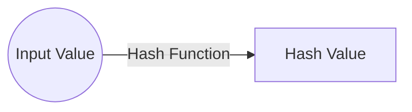

# 해시

**Hash**의 원래 뜻은 고기와 감자를 잘게 다져 만든 요리를 말합니다.

하나의 큰 자료를 작은 값으로 분해하고 조합해서 새로운 자료로 만드는 것이 해시입니다.
따라서, 해시는 값이 작다는 특징이 있습니다. 그뿐만 아니라 이 새로운 값은 다른 값과 구별할 수 있는 독특한 값이라는 특징도 있습니다.

## 해시의 개념

해시는 계산 과정을 거치면서 작아진 값을 말합니다.

### 해시 함수

**Hash function**은 아래의 그림을 살펴보면 이해가 됩니다.

해시 함수가 분해 및 조립 등의 연산을 통해 해시값을 만드는 함수란 것을 알 수 있습니다. 즉, 입력 값을 가지고 더하기, 곱하기 등 여러 연산을 통해 고유한 해시를 만드는 것이 해시 함수입니다.

### 해시 검색

**Search by hashing**은 해시를 이용하여 검색을 한다는 뜻입니다. 다른 검색 알고리즘과 비교하여 검색 속도가 월등히 빠르다는 장점이 있습니다.

먼저, **search key**가 주어져 있습니다. 여기서 검색 키란 내가 찾고자 하는 자료를 가리키는 값을 말합니다. 예를 들어, 학번으로 학생 자료를 찾을 때는 학번이 검색 키가 됩니다. 여기서 검색 키가 입력 값이 되고 계산된 해시는 검색하려는 자료의 위치(주소)가 됩니다. 아울러, 해시 함수로 계산한 주소에 따라 자료를 저장하는 자료 구조를 **hash table**이라고 합니다.  해시 테이블은 일반적으로 주소를 통해 바로 접근할 수 있는 array를 선호합니다.

**Bucket**은 해시 테이블에서 자룔를 저장하는 단위입니다. 하나의 고유한 해시(주소)에 대응하여 실제 자료가 저장되는 곳이 바로 버킷입니다.
버킷 안에 여러 개의 자료를 저장하는 경우도 생기는데 이 경우 소단위 저장소를 **slot**이라고 합니다. 즉, 1개의 버킷에 여러 개의 슬롯이 있을 수 있습니다.

>계산 검색 방법 vs. 비교 검색 방법
>
>해시 함수는 검색 키를 입력 값으로 단순 계산만 하면 되기 때문에 검색에 필요한 평균 시간 복잡도가 최소 $O(1)$입니다. 즉, 해시 함수를 이용한 검색의 가장 큰 장점은 자료의 개수 $n$과 상관없이 특정한 constant를 시간 내에 계산할 수 있다는 것 입니다. 해시 검색처럼 검색 키에 대해서 주소를 직접 계산하고 검색하는 것을 "**non-comparison search method**"라고 합니다.
>
>참고로, 해시 검색 이외의 검색 방법으로는 순차 검색, B-Tree를 이용한 검색 등이 있습니다. 이러한 검색 알고리즘들은 검색 키 값을 하나씩 비교해서 찾습니다. 이를 "**comparison search method**"라고 합니다. 비교 검색 방법은 비교적 빠른 검색 알고리즘을 이용해도 평균 시간 복잡도가 $O(\log n)$입니다. 그렇기 때문에, 자료의 개수가 증가하면 어쩔 수 없이 자료의 개수에 비례하여 검색 시간이 느려집니다.
>
>따라서 검색 성능 면에서 해시 검색이 비교 검색 방법 보다 상당히 우수한 것임을 알 수 있습니다. 단, 이러한 최적의 검색 성능이 가능하려면 해시 함수와 해시 테이블을 설계할 때 고려해야 할 몇 가지 제약 사항이 있습니다.

### 해시 검색의 과정

해시 검색이 검색 키에서 주소를 계산하는 방법을 사용한다는 것을 알고있습니다.

#### 자료 추가

해시 검색을 하려면 먼저 자료가 해시 테이블에 저장되어 있어야 합니다. 따라서 해시 검색이 이루어지려면 먼저 해시 테이블에 자료를 추가해야 합니다.

1. 주소 계산
2. 해시 테이블 확인
3. 자료 저장

1단계는 먼저 전달 받은 '검색 키'로 저장할 버킷의 주소를 계산합니다. '검색 키'가 분해/조립 과정을 거치면서 작아진 값, 즉 해시가 곧 주소입니다.

2단계는 앞서 계산된 주소를 가지고 해시 테이블을 확인합니다. 자료를 저장할 주소를 알고 있는데도 왜 해시 테이블을 먼저 확인하는 걸까요? 그 이유는 계산한 주소에 이미 자료가 있는 경우가 있기 때문입니다. 물론 계산한 주소에 자료가 없으면 바로 자료를 저장할 수 있습니다. 하지만, 주소에 이미 자료가 있어서 자료를 저장하지 못하는 경우가 발생할 수 있습니다. 이를 **collision**이라고 합니다.

3단계는 실제 해시 테이블에 자료를 저장하는 단계입니다. 앞서 해시 테이블을 확인하는 2단계를 통해 자료를 저장할 수 있는 빈 주소에 자료를 저장합니다. 만약 충돌이 발생하였다면 비어 있는 다른 곳을 찾아서 자료를 저장합니다.

#### 자료 검색

해시 검색은 2단계로 이루어져 있습니다.

1. 주소 계산
2. 해시 테이블 확인

먼저 전달 받은 검색 키 값으로 버킷의 주소를 계산합니다. 즉, 해시 함수를 이용하여 검색 키에 대한 주소를 계산합니다.

2단계로 앞서 계산한 주소를 이용하여 해시 테이블에 정말 그 자료가 저장되어 있는지 확인합니다. 만약 계산한 주소에 자료가 있으면 검색이 성공한 경우고 계산한 주소에 자료가 없다면 실패한 경우입니다.

## 해시 함수

