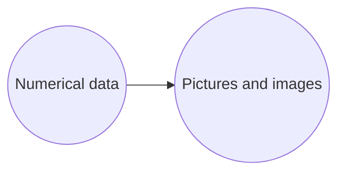

# Ch 1 Introduction

## What is computer graphics?

: Addition of "graphics" to text and numerical information.

### Backgrounds

* Humans are good at images
* a three portions of our brain is in charge of visual information
* "A picture is worth a thousand words"

Paradigm shift

A chronicle

> Early days: simple transformaion of numerical information to picture
>
> Present: Use graphics as a new toolto describe the large amount of numerical informaion, complicated natural phenomena, and virtual facts

Extension of graphics applications due to the development of computing devices

---

## Development of Computer Graphics

### Chronological order of development

* Before 1950's: graphic-oriented

* 1951: Demonstration of graphic display at Whirlwind (at MIT)

* 1955: **First light pen** at Lincoln Lab

* 1958: Drum plotter by Calcomp

* 1960: **William Fetter** at Boeing coined the term **"Computer Graphics"**

* 1961: **Ivan Sutherland** at MIT developed **Sketchpad**

  Pioneering system that used **GUI**

* 1962: Douglass Engelbart at Stanford Research Institute introduced a mouse

* 1963: IBM announced the first commercial CAD system "DAC..."

* 1964: IBM released a graphic console

  * A commercial digitizing tablet Grafacon was introduced

* 1965: Department of Computer Science at University of Utah

  * Direct View Storage Tube from Tektronix
  * CADAM(Lockheed) & CADD (McDonnell Douglas) systems

* 1969: GUI by Xerox

* 1968: Ivan Sutherland's HMD: **The sword of Damocles**

* 1970: P.Bezier (Renault) developed **Bezier curves** -> freeform shape 그리는데 도움

* 1971: **Gouraud shading** --> 가성비 좋다(속도가 빠르다.) --> OpenGL default shader

* 1972: C language by D.Ritchie

* 1973: **Riesenfeld** at Syracuse Univ. introduced **B-splines**

* 1974: **Z-buffer** by **Ed Catmull** (Utah)

* 1975: **Phong shading**(can represent specular colors) by **Bui-Tuong Phong** (Utah --> Stanfold)

  * Martin Newell's CGI teapot (Utah)

* 1976: Apple computer by Steve Jobs & Steve Wozniak

* 1979: IGES format

* 1980: Turner Whitted announced **Ray Tracing** --> Develop animations

* 1981: IBM's first personal computer

* 1982: First CG animation movie "Tron" by Disney

* 1984: First CG commercial - Robbot

* 1984: Radiosity (Cornell Univ.)

* 1985: PostScript (Adobe)

* 1986: X-Window system (MIT)

* 1988: Pixar's "Tin Toy" got an Academy Awards

* 1992: **OpenGL**

  * Introduction of CAVE at SIGGRAPH92 (University of illinois)

* 1995: "Toy Story" by Disney & Pixar

* 1999: Star Wars Episode One - Take advantage of 66 digital charaters (live action)

* 2000~: CG games and movies

---

## Application of Computer Graphics

VR - Cave automatic virtusal environment

---

# Ch 2 Hardwar & Software

* Hardware for computer graphics
  * Basic theory and brief history
  * Knowledge on recent equipment
* High-level graphics software

## Hardware

### Display

#### CRT(Cathode Ray Tube)

**Leaves a trace** on the chemically treated screen by moving **electron beam**

Refresh rate: over 50Hz

##### Random Scan Display

>Picture definition is stored as a set of line-drawing commands in an area of memory referred to as the **refresh display file**. To display a specified picture, the system cycles through the set of commands in the display file, drawing each component line in turn. After all the line-drawing commands are processed, the system cycles back to the first line command in the list.
>
>**Vector Display** or Stroke Device (vector display, stroke-writing display, or calligraphic display)
>
>Beam randomly moves; The direction is controlled by the program.
>
>Example: Tektrox storage tube
>
>Advantages
>
>* **No refreshing** is needed.
>* Very complex pictures can be displayed at very high resolution **without flicker.**
>
>Disadvantages
>
>* They ordinarily **do not display color.**
>* Selected part of the picture can not be erased.
>* The erasing and redrawing process can take several seconds for complex pictures.

##### Raster Scan Display

>In a raster scan system, the electron beam is swept across the screen, one row at a time from top to bottom. As the electron beam moves across each row, the beam intensity is turned on and off to create a pattern of illuminated spots.
>
>Picture definition is stored in memory area called the **Refresh Buffer**(v-Random Access Memory: expensive memory because of static memory) or **Frame Buffer**. This memory area holds the set of intensity values for all the screen points. Stored intensity values are then retrieved from the refresh buffer and “painted” on the screen one row (scan line) at a time as shown in the following illustration.
>
>Each screen point is referred to as a **pixel (picture element)** or **pel**. At the end of each scan line, the electron beam returns to the left side of the screen to begin displaying the next scan line.
>
>**Raster Display** or Raster Scan Device
>
>Beam moves in the same pattern (line by line) - Pixel is on or off in the line
>
>Always operates in refresh mode
>
>Similar to TV technology
>
>Source to the all current display, including LCD
>
>***Therefore, CG is a programming to channel pixels with intensity of color.***
>
>Store the current bitmap to video memory.
>
>Color needs multiple bit planes
>
>**N bit planes = N bits per pixel = $2^N$ colors**
>
>**A single pixel requires 8 bits.**
>
>Number of pixels on screen determines the quality(resolution) of graphics.
>
>Required memory of refresh buffer = Resolution x Bit planes [bits]
>
>Reasons of graphic memory having large amount of storages
>
>* For being used to compute
>* For mapping textures
>
>**Refresh Rate** [Hz] = cycle(frame) per second
>
>**Horizontal retrace time**: time for the beam to move from the end of horizontal line to the start of next line.
>
>**Vertical retrace time**: time for the beam to jump to the top-left corner after each frame
>
>**Interlaced vs. non-interlaced**
>
>1080**i**(interlaced) vs. 1080**p**(progressive)

---

Emissive - convert the electronic energy into light (e.g. plasma, linght-emitting diodes)

Non-emissive - convert the light (like sunlight) into graphic pattern using the electro-optical effect (e.g. LCD)

---

### Plasma Display Panel

Gas-discharge display(Apply the voltage to horizontal and vertical conductors which are glass plates filled the mixture gas between --> **plasma effect**)

#### **Plasma Effect**

---

### LCD

Use of **polarization** of light

Polarized light passes through the liquid crystal

**PM(Passive Matrix) 구동방식**

PM 구동방식은 하나의 라인 전체가 구동하는 방식으로 Direct 구동방식보다 많은 정보를 표현할 수 있습니다. Driver IC(구동 회로)에 연결된 세로전극과 가로전극이 엇갈려 놓여있는 구조인데요. 가로 세로 전극이 서로 엇갈려 겹치는 부분이 하나의 ‘픽셀’이 되는 것이죠. 가로 전극인 Scan Driver IC는 위부터 아래까지 차례로 라인을 선택하는 역할을 하고, 세로 전극인 Data Driver IC는 어느 픽셀에 정보를 넣을지를 선택합니다.

지하철 전광판 같은 디스플레이가 대표적인 PM 구동방식인데요. 전광판의 정보들은 가로 전극과 세로 전극이 계속 빠르게 움직이며 픽셀들을 제어해서 나타나는 것입니다. 우리 눈에 보이지 않을 정도의 빠른 속도로 말이죠. 그런데 화면이 점점 넓어지고 픽셀이 작아질수록 Scan Driver IC의 속도를 유지하는 것이 어려워집니다. 때문에 PM 구동방식은 고해상도나 동영상과 같은 정보를 표현하는 데에 한계가 있지요.

 

**AM(Active Matrix) 구동방식**

능동형 구동이라고도 하는 AM 구동방식은 하나의 소자가 각각 구동하는 방식입니다. PM 구동방식과 비교했을 때 좀 더 진보된 방식이라 할 수 있죠. PM 구동방식처럼 가로 세로 전극의 전압 차이를 이용하지만, AM 구동방식은 박막 트랜지스터([TFT](http://blog.lgdisplay.com/2016/04/tft/): Thin Film Transistor)와 저장 커패시터(Storage Capacitor: 한 픽셀에 들어온 전압을 한 프레임 내에 유지할 수 있도록 도와주는 장치)를 가지고 있습니다.

스위치 역할을 담당하는 TFT는 크로스 토크(Cross Talk: 픽셀간의 간섭효과에 따라 디스플레이 화질이 선명하지 않게 구현되는 현상)현상을 최소화합니다. 또한, 저장 커패시터는 1프레임 동안 들어온 신호를 저장시켜 일정한 빛을 내도록 하는 역할을 하죠. 이처럼 PM 구동방식에 비해 발광 효율이 개선된 AM 구동방식은 현재의 LCD, OLED에 적용되고 있기 때문에 대부분의 TV, 노트북, 휴대폰, 태블릿 제품은 AM 구동방식이라 할 수 있습니다.

---

## Software

* SGL GL(Silicon Graphics)
* OpenGL
* OpenInventor
* Java 2D/ Java 3D
* OpenCASCADE/ OpenSG/ OpenScene

#### OpenGL

**Graphics via API**(Application Programming Interface)

**Independent to OS**

Characteristics

* Stability - Standardization
* Reliability by independent to OS
* Transparency by independent to OS
* Flexibility by independent to OS
* Easy to use
* Abundant references and examples
* GOD(?)

Functions

* Basic primitives - points, lines, curves ...
* Attribute - color, breadth, pattern, text
* Viewing - position, direction, clipping
* Transformation - rotation, translation, scaling
* Input - keyboard, mouse
* Control - communication to Window, program initialization

---

# Ch 3 Graphics Output Primitives

* Geometric objects: scalar/ vector/ coordinate system
* Points
* Lines/ Curves
* Planes/ Polygons
* OpenGL

## Geometric Objects

3 objects

* Scalar
* Point
* Vector

3D geometric objects

* Lines
* Planes
* Texts

### Scalar

Use real numbers

Measurement unit in graphics

Operations: additions & multiplications

### Coordinate System

Absolute coordinate system: position w.r.t. the origin

Relative coordinate system: previous position becomes the origin --> vector

Descartes coordinate system = cartesian coordinate system

#### Frame

Frame using the origin and vectors

Reeplace the coordinate system by the frame --> solves the vector problem

### Points

basic entity or element

No magnitude, only position

Used to represent the position in 3D space

### Vectors

Spatial vectors

Directional line segment

Points vs. Vectors

A location (in the Cartesian 3D space) could be described with (x,y,z)
Conceptual difference between them
​	A point indicates a location, while a vector indicates a direction and length.
​	If a distinguished point (the origin) is given, one can describe a location by giving the direction and distance.

#### Vector Operations

Vectors

Magnitude

Inner product

Angle

Cross product

Projection

​	Scalar projection

​	Vector projection

### Matrix

Pre product vs. Post product

New point is obtained by old point in multiplying by matrix(transformation, scalar, rotation)

### Lines

Represent a line connection $\mathbf{P_1}$ and $\mathbf{P_2}$ using a parameter $t$
$$
\mathbf{P}(t) = \mathbf{P_1} + t(\mathbf{P_2} - \mathbf{P_1}) \\
\mathbf{P}(t) = \mathbf{P_1} + t * \mathbf{slope} \\
\mathbf{P}(t) = (1 - t) \mathbf{P_1} + t * \mathbf{P_2} \to barycentric: ratio
$$
Algorithms

* Lines
  * DDA(Digital Differential Analyzer) algorithm
  * **Bresenham's line algorithm**
  * Parallel line algorithm
* Circle
  * Midpoint circle algorithm
* Ellipse
  * midpoint ellipse algorithm

## Bresenham's Line Algorithm##

How to locate the position of $(x_{k+1}, \ y_{k+1})$ 

Let $x_{k+1} = x_k +1$ , straightforwardly!
$$
y = m\,x_{k+1} + b\\
$$

$$
d_{lower} = y - y_k = (m\,x_{k+1} + b) - y_k\\
d_{upper} = y_{k+1} - y = y_{k+1} - (m\,x_{k+1} + b)\\
$$

$$
d_{lower}-d_{upper} = 2m\, x_{k+1} - 2y_k + 2b -1\\
m = {\Delta y\over\Delta x} \to (\Delta x, \Delta y)\ is\ determined\ from\ two\ end\ points\ (given)\\
p_k = (d_{lower}-d_{upper})\Delta x =  2x_k\Delta y - 2y_k\Delta x + c\\
c = 2\Delta y - \Delta x(2b-1)\\
$$

$$
if) p_k > 0 \to choose y_{k+1}\\
else) choose y_k
$$

$$
p_{k+1} - p_k = 2\Delta y (x_{k+1} - x_k) - 2\Delta x(y_{k+1} - y_k)\\
y_{k+1} - y_k= 0\ or\ 1\\
p_0 = 2\Delta y - \Delta x
$$

---

# Ch 4 2D Transformation

* Transformation
  * Translation/ Rotation/ Scaling/ Reflection
* Concatenated transformations
* Representation using matrices
* Matrix operation by homogeneous coordinate system

## Homogeneous Coordinates: Projective Geometry

$2D: (x,y) \to (X, Y, W),\ X=xW,\ Y=yW,\ W \ne 0$

>An efficient way to represent multiple matrices(translation/ rotation) using a single matrix
>
>Successive transformations are represented in form of matrix multiplications

Matrix: $[Q] = [P] + [T]$
$$
\begin{bmatrix}
Q_x \\
Q_y \\
1
\end{bmatrix} = 
\begin{bmatrix}
P_x \\
P_y \\
1
\end{bmatrix} + 
\begin{bmatrix}
T_x \\
T_y \\
0
\end{bmatrix}
$$

### Translation

$$
\begin{bmatrix}
Q_x \\
Q_y \\
1
\end{bmatrix} = 
\begin{bmatrix}
1 & 0 & T_x \\
0 & 1 & T_y \\
0 & 0 & 1
\end{bmatrix}
\begin{bmatrix}
P_x \\
P_y \\
1
\end{bmatrix}
$$

### Scaling

$$
\begin{bmatrix}
Q_x \\
Q_y \\
1
\end{bmatrix} = 
\begin{bmatrix}
S_x & 0 & 0 \\
0 & S_y & 0 \\
0 & 0 & 1
\end{bmatrix}
\begin{bmatrix}
P_x \\
P_y \\
1
\end{bmatrix}
$$

### Rotation

$$
\begin{bmatrix}
Q_x \\
Q_y \\
1
\end{bmatrix} = 
\begin{bmatrix}
cos(\theta) & -sin(\theta) & 0 \\
sin(\theta) & cos(\theta) & 0 \\
0 & 0 & 1
\end{bmatrix}
\begin{bmatrix}
P_x \\
P_y \\
1
\end{bmatrix}
$$

### Rotation with pivot

$$
[R] = [T(x_r, y_r)][R_z(\theta)][T(-x_r,-y_r)]\\
$$

$$
\begin{bmatrix}
Q_x \\
Q_y \\
1
\end{bmatrix} = 
\begin{bmatrix}
1 & 0 & T_x \\
0 & 1 & T_y \\
0 & 0 & 1
\end{bmatrix}
\begin{bmatrix}
cos(\theta) & -sin(\theta) & 0 \\
sin(\theta) & cos(\theta) & 0 \\
0 & 0 & 1
\end{bmatrix}
\begin{bmatrix}
1 & 0 & -T_x \\
0 & 1 & -T_y \\
0 & 0 & 1
\end{bmatrix}
\begin{bmatrix}
P_x \\
P_y \\
1
\end{bmatrix}\\
$$

$$
\begin{bmatrix}
Q_x \\
Q_y \\
1
\end{bmatrix} = 
\begin{bmatrix}
cos(\theta) & -sin(\theta) & x_r(1-cos(\theta)) + y_rsin(\theta) \\
sin(\theta) & cos(\theta) & y_r(1-cos(\theta)) - x_rsin(\theta) \\
0 & 0 & 1
\end{bmatrix}
\begin{bmatrix}
P_x \\
P_y \\
1
\end{bmatrix}
$$

# Ch 5 3D Transformation

### Translation

$$
\begin{bmatrix}
Q_x \\
Q_y \\
Q_z \\
1
\end{bmatrix} = 
\begin{bmatrix}
1 & 0 & 0 & T_x \\
0 & 1 & 0 & T_y \\
0 & 0 & 1 & T_z \\
0 & 0 & 0 & 1
\end{bmatrix}
\begin{bmatrix}
P_x \\
P_y \\
P_z \\
1
\end{bmatrix}
$$

### Scaling

$$
\begin{bmatrix}
Q_x \\
Q_y \\
Q_z \\
1
\end{bmatrix} = 
\begin{bmatrix}
S_x & 0 & 0 & 0 \\
0 & S_y & 0 & 0 \\
0 & 0 & S_z & 0 \\
0 & 0 & 0 & 1
\end{bmatrix}
\begin{bmatrix}
P_x \\
P_y \\
P_z \\
1
\end{bmatrix}
$$

### Rotation

z-axis: $[R_z(\theta)]$
$$
\begin{bmatrix}
Q_x \\
Q_y \\
Q_z \\
1
\end{bmatrix} = 
\begin{bmatrix}
cos(\theta) & -sin(\theta) & 0 & 0\\
sin(\theta) & cos(\theta) & 0 & 0\\
0 & 0 & 1 & 0\\
0 & 0 & 0 & 1\\
\end{bmatrix}
\begin{bmatrix}
P_x \\
P_y \\
P_z \\
1
\end{bmatrix}
$$

x-axis: $[R_x(\theta)]$
$$
\begin{bmatrix}
Q_x \\
Q_y \\
Q_z \\
1
\end{bmatrix} = 
\begin{bmatrix}
1 & 0& 0& 0\\
0 & cos(\theta) & -sin(\theta) & 0\\
0 &sin(\theta) & cos(\theta) & 0\\
0 & 0 & 0 & 1\\
\end{bmatrix}
\begin{bmatrix}
P_x \\
P_y \\
P_z \\
1
\end{bmatrix}
$$
y-axis: $[R_y(\theta)]$
$$
\begin{bmatrix}
Q_x \\
Q_y \\
Q_z \\
1
\end{bmatrix} = 
\begin{bmatrix}
cos(\theta) & 0 & sin(\theta) & 0\\
0 & 1 & 0 & 0 \\
-sin(\theta) & 0 & cos(\theta) & 0\\
0 & 0 & 0 & 1\\
\end{bmatrix}
\begin{bmatrix}
P_x \\
P_y \\
P_z \\
1
\end{bmatrix}
$$

### Rotation with pivot

$$
[R] = [T]^{-1}[R_x(\alpha)]^{-1}[R_y(\beta)]^{-1}[R_z(\theta)][R_y(\beta)][R_x(\alpha)][T]\\
$$

