# 수업에 들어가기 전

> Implicit code: 정적인 구조 해석 용 코드, e.g. nastran
>
> Explicit code: 충돌이나 짧은 시간 내 이루어지는 변형을 해석하는 코드, e.g. LS-DYNA

# 문제 1) 'ㄱ' 빔

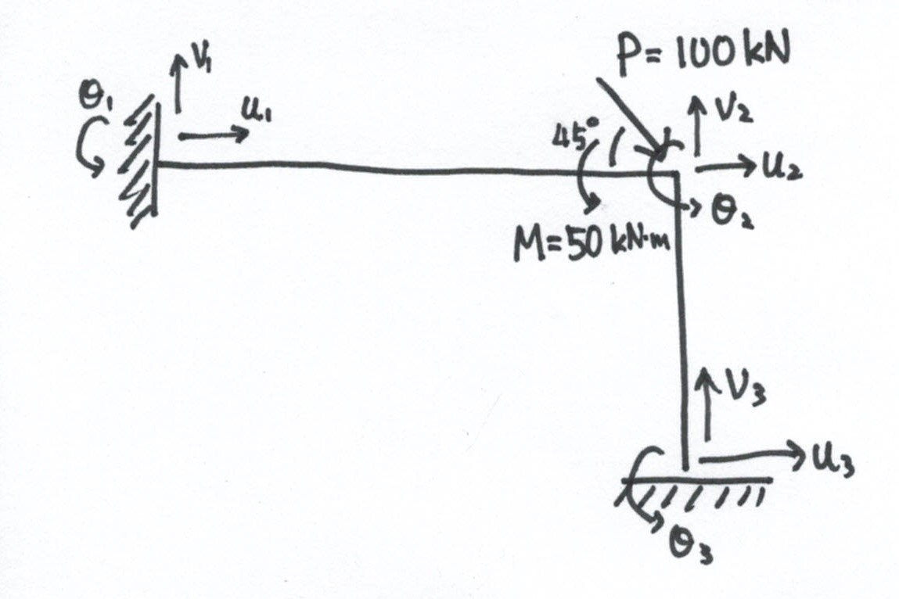{.alignright}

| Properies |        Element 1         |        Element 2         |
| :-------: | :----------------------: | :----------------------: |
|    $L$    |           $8m$           |           $5m$           |
|    $A$    |  $6\times10^{-3} m^{2}$  |  $4\times10^{-3} m^{2}$  |
|  $I_{z}$  | $200\times10^{-6} m^{4}$ | $50\times10^{-6} m^{4}$  |
|    $J$    | $300\times10^{-9} m^{4}$ | $100\times10^{-9} m^{4}$ |
|    $E$    |        $200 GPa$         |                          |
|   $\nu$   |          $0.3$           |                          |

$sol)$
$$
\begin{bmatrix}
\frac{EA}{L} &0&0&0&0&0&-\frac{EA}{L}&0&0&0&0&0 \\
0&0&0&0&0&0&0&0&0&0&0&0\\
0&0&0&0&0&0&0&0&0&0&0&0\\
0&0&0&\frac{GJ}{L}&0&0&0&0&0&-\frac{GJ}{L}&0&0\\
0&0&0&0&0&0&0&0&0&0&0&0\\
0&0&0&0&0&0&0&0&0&0&0&0\\
-\frac{EA}{L} &0&0&0&0&0&\frac{EA}{L}&0&0&0&0&0 \\
0&0&0&0&0&0&0&0&0&0&0&0\\
0&0&0&0&0&0&0&0&0&0&0&0\\
0&0&0&-\frac{GJ}{L}&0&0&0&0&0&\frac{GJ}{L}&0&0\\
0&0&0&0&0&0&0&0&0&0&0&0\\
0&0&0&0&0&0&0&0&0&0&0&0\\
\end{bmatrix}
$$
그리고, 평면에 대한 벡터 회전변환은 
$$
a_{ij} = e_{i}^{'}\cdot e_{j} = \cos(e_{i}^{'}, e_{j})
$$
로 나타낼 수 있다.

## 부정정 차수

$r = n + m - 3s$

$n = 3+3 = 6$

$m = 3$

$s = 2$

$\therefore r = 3$

## 부재 1의 강성 행렬

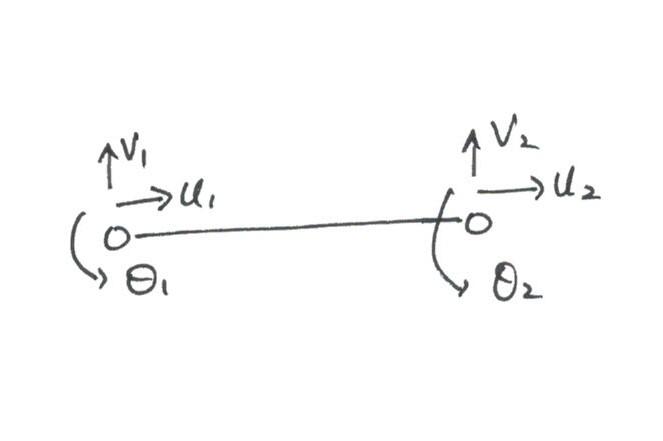

### 축력(N)에 관한 강성행렬

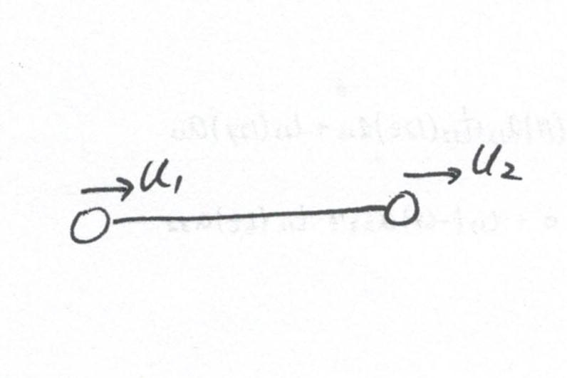

> $case\ 1)$
>
> 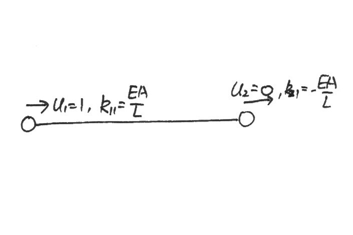
> $$
> u_{1} = 1, u_{2} = u_{3} = u_{4} = 0 \\
> $$
> 이로 인한, 강성행렬은
> $$
> k_{11} = \frac{EA}{L}, k_{21} = k_{41} = 0, k_{31} = -\frac{EA}{L}\\
> $$
>

> $case\ 2)$
> $$
> u_{2} = 1, u_{1} = u_{3} = u_{4} = 0 \\
> $$
> 이로 인한, 강성행렬은
> $$
> k_{12} =  k_{22} = k_{32} = k_{42} = 0\\
> $$
>

> $case\ 3)$
>
> 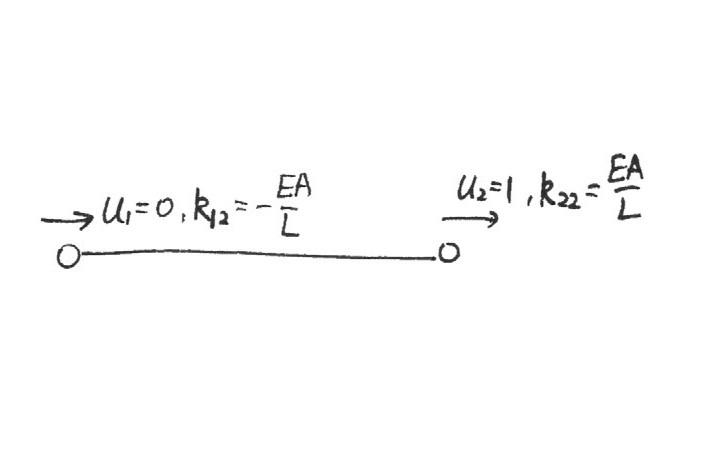
> $$
> u_{3} = 1, u_{1} = u_{2} = u_{4} = 0 \\
> $$
> 이로 인한, 강성행렬은
> $$
> k_{13} = -\frac{EA}{L}, k_{23} = k_{43} = 0, k_{33} = \frac{EA}{L}\\
> $$
>

> $case\ 4)$
> $$
> u_{4} = 1, u_{1} = u_{2} = u_{3} = 0 \\
> $$
> 이로 인한, 강성행렬은
> $$
> k_{14} =  k_{24} = k_{34} = k_{44} = 0\\
> $$
>

>  $$
>  \therefore \begin{bmatrix}
>  \frac{EA_{1}}{L_{1}} & 0 & 0 & -\frac{EA_{1}}{L_{1}} & 0 & 0 \\
>  0 & 0 & 0 &0 & 0 & 0 \\
>  0 & 0 & 0 &0 & 0 & 0 \\
>  -\frac{EA_{1}}{L_{1}} & 0 & 0 & \frac{EA_{1}}{L_{1}} & 0 & 0 \\
>  0 & 0 & 0 &0 & 0 & 0 \\
>  0 & 0 & 0 &0 & 0 & 0 \\
>  \end{bmatrix}
>  $$
>

### 모멘트(M)에 관한 강성행렬

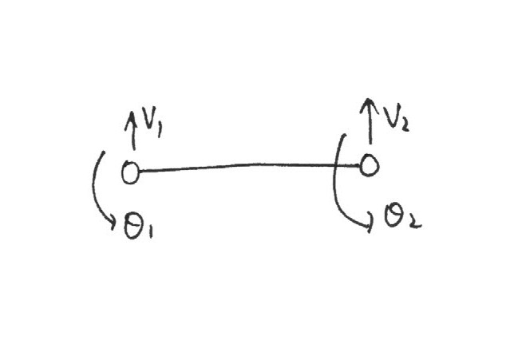

> $case\ 1)$
>
> 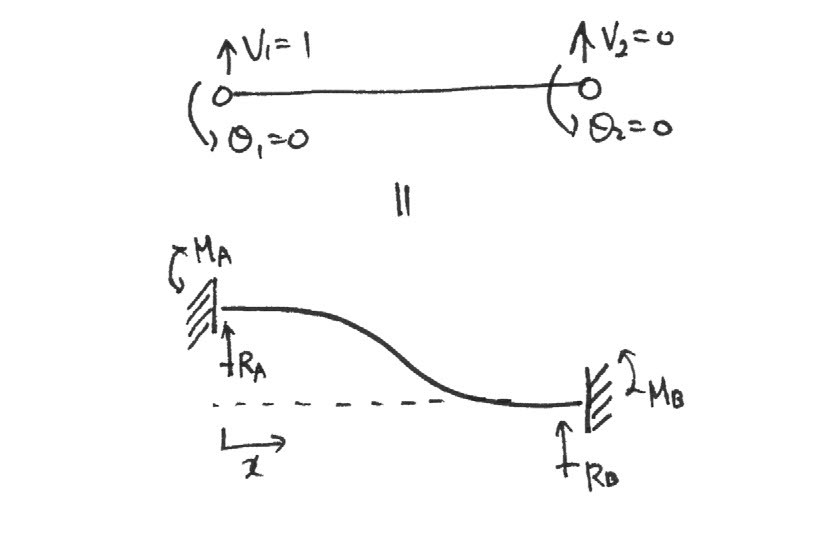
>
> 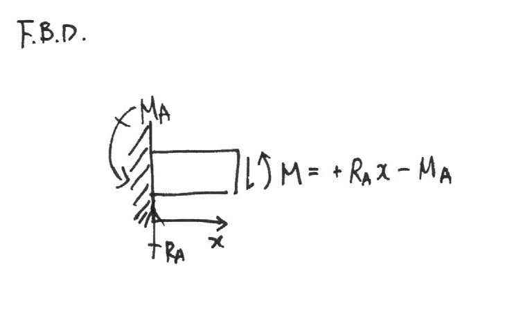
>
> $castigliano$를 적용하면, 
> $$
> \theta_1 =  \int^{l}_{0} \frac{M}{EI}\cdot {\partial M \over\partial M_A} \, dx \\
> =  \int^{l}_{0} \frac{(R_{A}\ x - M_{A})}{EI}\cdot (-1) \, dx \\
> = \frac{1}{EL} \left[ -\frac{R_{A}}{2}x^{2} + M_{A}\ x \right] _{0}^{l} \\
> =  \frac{1}{EL} \left[ -\frac{R_{A}}{2}l^{2} + M_{A}\ l \right]  = 0 \\
> \to M_{A} = \frac{R_{A}\ l}{2}
> $$
>
> $$
> v_1  =  \int^{l}_{0} \frac{M}{EI}\cdot {\partial M \over\partial R_A} \, dx \\
> = \int^{l}_{0} \frac{(R_{A}\ x - M_{A})}{EI}\cdot x \, dx \\
> = \frac{1}{EL} \left[ \frac{R_{A}}{3}x^{3} - \frac{M_{A}}{2}x^{2} \right] _{0}^{l} \\
> = \frac{1}{EL} \left[ \frac{R_{A}}{3}l^{3} - \frac{M_{A}}{2}l^{2} \right] \\
> = \frac{1}{EL} \left[ \frac{R_{A}}{3}l^{3} - \frac{R_{A}}{4}l^{3} \right] = \frac{R_{A}\ l^{3}}{12EI} = 1 \\
> \to R_{A} = \frac{12EI}{l^{3}} \\
> M_{A} = \frac{6EI}{l^{2}}
> $$
>
> $$
> \sum F_y = 0; \qquad R_B= -R_A = -\frac{12EI}{l^{3}} \\
> \sum M = 0; \qquad M_{A} + M_{B} -l \cdot R_A = 0 \to M_B = \frac{6EI}{l^{2}}
> $$
>

> $case\ 2)$
>
> 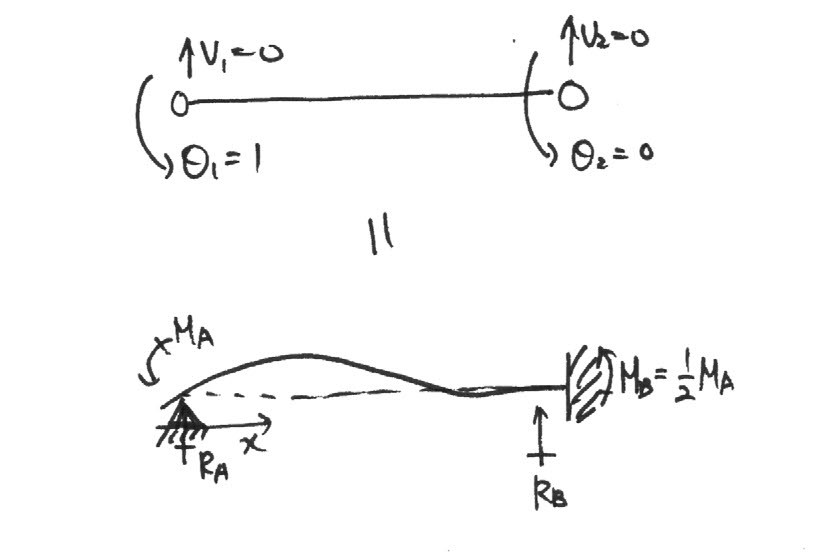
>
> 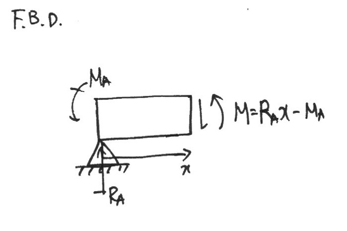
>
> $castigliano$를 적용하면, 
>
> $$
> v_1 = \frac{1}{EL} \left[ \frac{R_{A}}{3}l^{3} - \frac{M_{A}}{2}l^{2} \right] = 0 \\
> \to M_{A} = \frac{2R_A\ l}{3} \\
> $$
>
> $$
> \theta_1 =  \frac{1}{EL} \left[ -\frac{R_{A}}{2}l^{2} + M_{A}\ l \right] \\
> = \frac{1}{EL} \left[ -\frac{R_{A}}{2}l^{2} + \frac{2R_A}{3}l^2 \right] = 0 \\
> \to R_{A} = \frac{6EI}{l^2} \\
> M_{A} = \frac{4EI}{l}
> $$
>
> $$
> \sum F_y = 0; \qquad R_B= -R_A = -\frac{6EI}{l^{3}} \\
> by\ the\ carry-over\ factor\ in\ cantilever; \qquad M_{B} = \frac{1}{2}M_A = \frac{2EI}{l}
> $$
>
> 
>

> $case\ 3)$
>
> 
>
> 
>
> $castigliano​$를 적용하면, 
> $$
> v_1 = \frac{1}{EL} \left[ \frac{R_{A}}{3}l^{3} - \frac{M_{A}}{2}l^{2} \right] = 0 \\
> \to M_{A} = \frac{2R_A\ l}{3} \\
> $$
>
> $$
> \theta_1 =  \frac{1}{EL} \left[ -\frac{R_{A}}{2}l^{2} + M_{A}\ l \right] \\
> = \frac{1}{EL} \left[ -\frac{R_{A}}{2}l^{2} + \frac{2R_A}{3}l^2 \right] = 0 \\
> \to R_{A} = \frac{6EI}{l^2} \\
> M_{A} = \frac{4EI}{l}
> $$
>
> $$
> \sum F_y = 0; \qquad R_B= -R_A = -\frac{6EI}{l^{3}} \\
> by\ the\ carry-over\ factor\ in\ cantilever; \qquad M_{B} = \frac{1}{2}M_A = \frac{2EI}{l}
> $$
>
> 

# 문제 2) 하중이 쉬어 중심에 작용하지 않는 빔

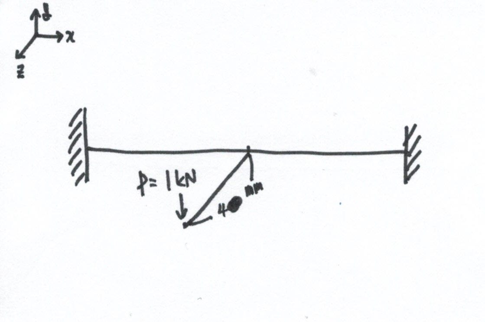

$sol)$

작용하는 하중을 쉬어 중심으로 가져오고 하중과 거리를 곱한 값으로 토션을 줘서 동치 상태로 만들어 준다.

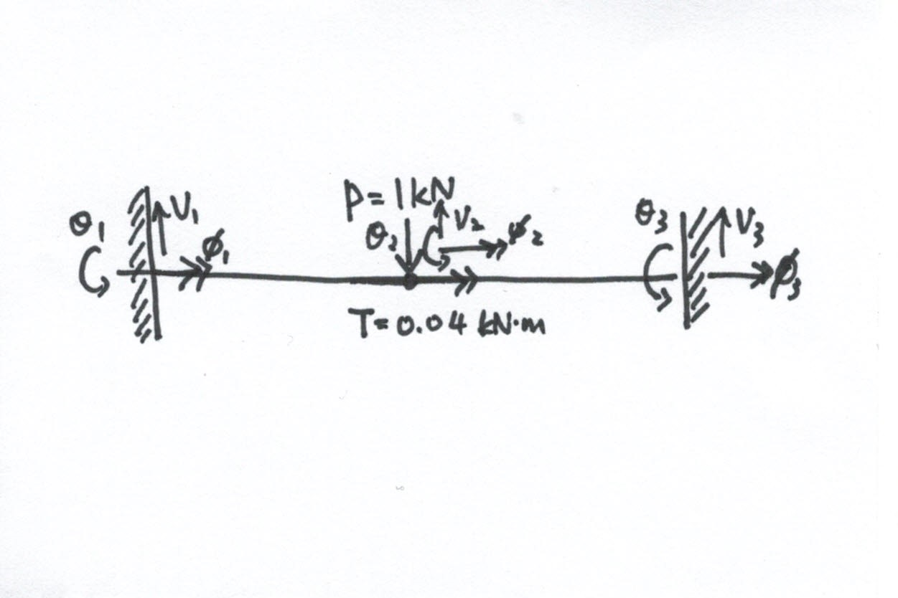

# 문제 3) 분포하중이고, 노드 밖에 하중이 작용하는 빔

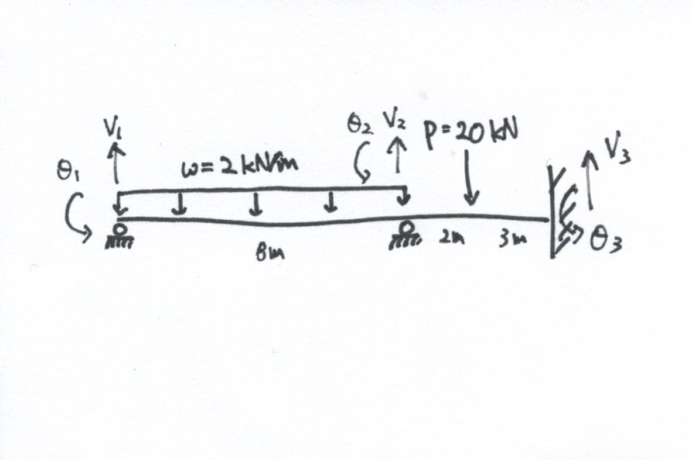

$sol)$

노달 포인트 외부에 존재하는 하중과 분포하중을 노드 위에 작용하는 하중으로 치환한다.

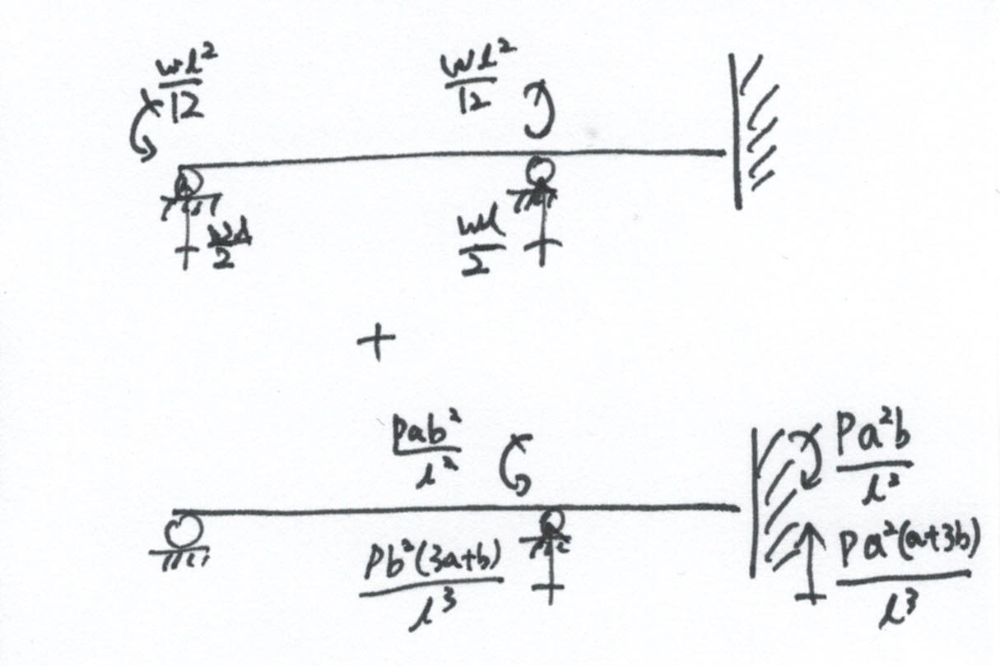

기존의 강성행렬 식에서 fixed end 외력 항이 추가되어 아래와 같다.
$$
\left( P \right) = \left[ K \right]\left( D \right) \to \left( P \right) = \left[ K \right]\left( D \right) + \left( P_{f} \right)
$$
즉, 강성행렬을 벤딩에 의한 처짐과 처짐각 변화를 행렬과 곱하고, 노달 포인트 밖의 하중과 분포하중을 각각 노달 포인트 상에 작용하는 하중으로 변화시켜 외력 행렬로 나타내 더한다.
$$
\begin{pmatrix} V_{1}\\ M_{1}\\ V_{2}\\ M_{2}\\ V_{3}\\ M_{3}\\ \end{pmatrix} 
= \begin{bmatrix}
\\
\\
K\\
\\
\\
\\
\end{bmatrix}
\begin{pmatrix} v_{1}\\ \theta_{1}\\v_{2}\\ \theta_{2}\\v_{3}\\ \theta_{3}\\ \end{pmatrix} 
+
\begin{pmatrix}
\frac{\omega l}{2}\\
\frac{\omega l^{2}}{12}\\
\frac{\omega l}{2} + \frac{Pb^{2}(3a+b)}{l^3}\\
-\frac{\omega l^{2}}{12} + \frac{Pab^2}{l^2}\\
-\frac{Pa^{2}(a+3b)}{l^3}\\
\frac{Pa^2b}{l^2}\\
\end{pmatrix}
$$

# 문제 4) 꺽인 빔

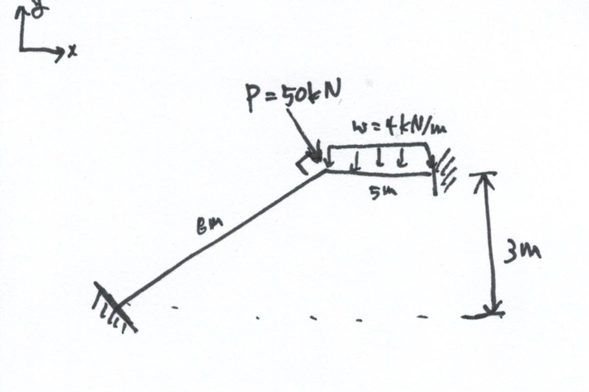

$sol)$

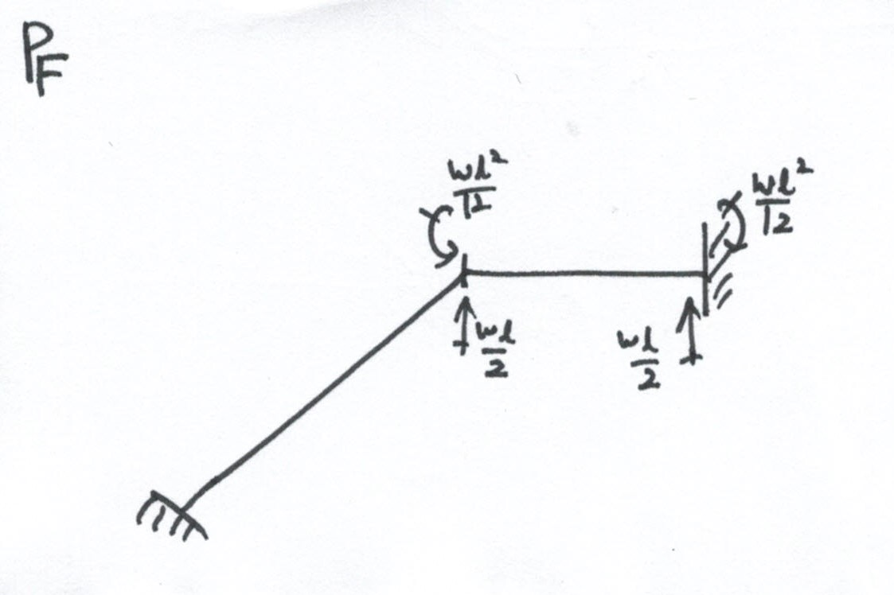
$$
\begin{pmatrix} P_{1}\\V_{1}\\ M_{1}\\ {3 \over 8}P\\-{\sqrt{55} \over 8}P\\ M_{2}\\ P_{3}\\V_{3}\\ M_{3}\\ \end{pmatrix} 
= \begin{bmatrix}
\\
\\
K\\
\\
\\
\\
\end{bmatrix}
\begin{pmatrix} u_{1}\\v_{1}\\ \theta_{1}\\u_{2}\\v_{2}\\ \theta_{2}\\u_{3}\\v_{3}\\ \theta_{3}\\ \end{pmatrix} 
+
\begin{pmatrix} 0\\0\\0\\ 0\\\frac{\omega l}{2}\\ \frac{\omega l^{2}}{12}\\ 0\\\frac{\omega l}{2}\\ -\frac{\omega l^{2}}{12}\\ \end{pmatrix}
$$
