# 구조역학

외력에 의해서 구조물의 받침점에 생기는 반력, 구조물의 내면에 생기는 변형력(내력) 및 구조물의 변형, 나아가 구조물의 내하성상을 연구한다.

---

# 정정 구조물 & 부정정 구조물

- 정정 구조물(determinate structure)
  안정하며, 외력과 반력이 평형방정식($\sum{F_{v}=0}, \sum{F_{h}=0}, \sum{M=0}$)으로 계산되는 구조물

- 부정정 구조물(indeterminate structure)
  안정하며, 힘의 평형방정식만으로는 완전히 계산되지 않는 구조물

구조물이 정정이냐 부정정이냐에 따라 해석방법이 완전히 달라지기 때문에 이 둘을 구별하는 것은 중요하다.

## 부정정 판별식

$$
r = n + m -3s
$$

$n:$ 지점 결합력 수, 부재를 고정시키는 방법에 따라

$m:$ 절점 결합력 수, 부재끼리 연결 방법에 따라

$s:$ 부재 수

$r = 0 \to$ 정정 구조물

$r > 0 \to$ 부정정 구조물이고, $r$의 값은 부정정 차수를 의미한다.

>  결합력 수 판단
>  |                  **n**                   | 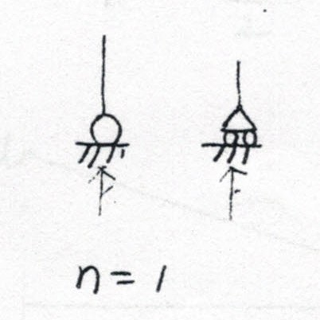 | 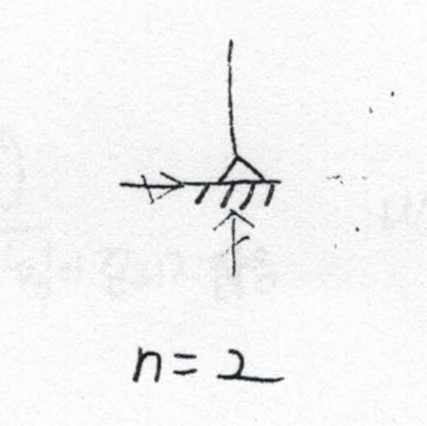 | 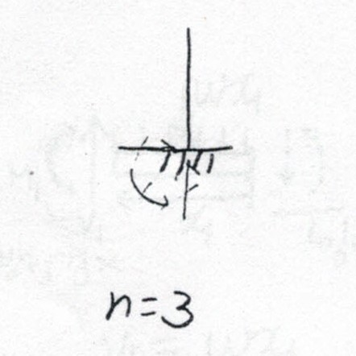 |
>  | :--------------------------------------: | :--------------------------------------: | :--------------------------------------: | :--------------------------------------: |
>  |                  **m**                   | 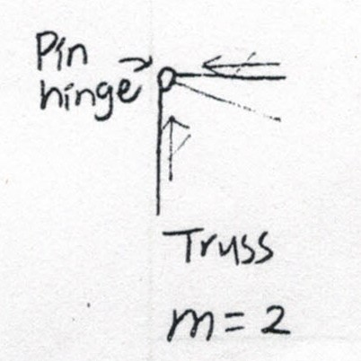 | 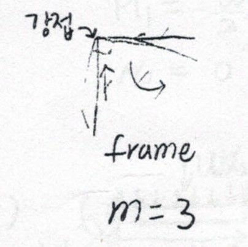 | 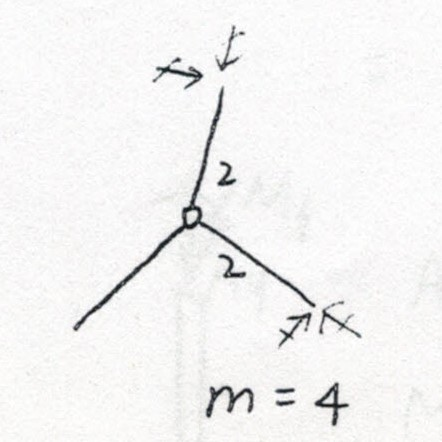 |
>  | 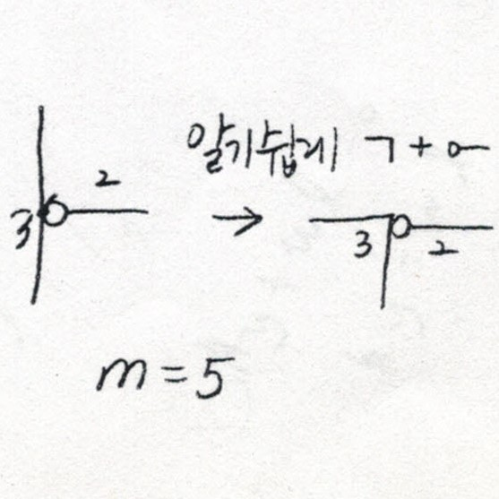 | 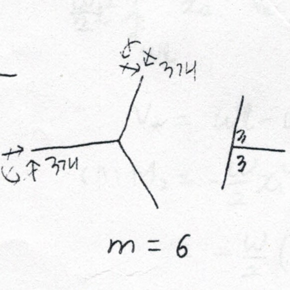 | 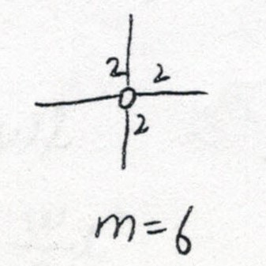 | 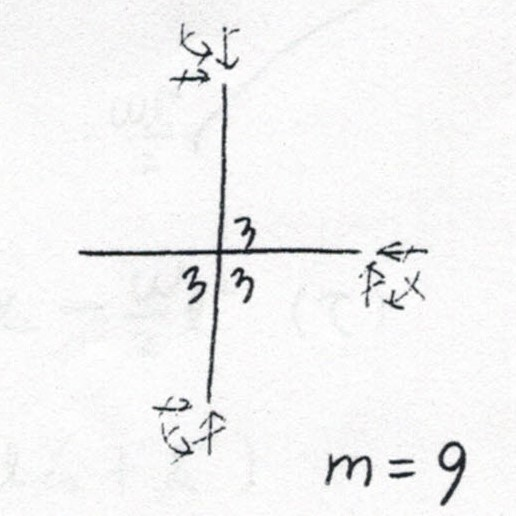 |

---

# 재료역학

## 응력(stress, $\sigma$)과 변형률(strain, $\epsilon$)

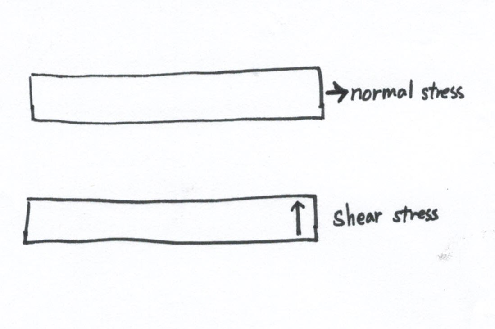
$$
\sigma = \sigma_{ij}\cdot e_{i} \cdot e_{j}
$$
$e_{i}:$ $x$방향 단위 벡터

$e_{j}:$ $y$방향 단위 벡터
$$
\left[ \sigma_{ij} \right]= 
\begin{bmatrix}
\sigma_{11} & \sigma_{12} & \sigma_{13}\\
\sigma_{21} & \sigma_{22} & \sigma_{23}\\
\sigma_{31} & \sigma_{32} & \sigma_{33}\\
\end{bmatrix}
$$
$i=j:$  주 대각선(diagnal) 위에 존재하는 응력은 $normal\ stress$이고, $e.g.\quad \sigma_{11}, \sigma_{22}, \sigma_{33}$

$i\ne j:$  주 대각선 위에 존재하지 않는 응력은 $shear\ stress$이다. $e.g.\quad \sigma_{12}, \sigma_{13}, \sigma_{23} ,\ ... \ as\  same\ as\quad \tau_{12}, \tau_{13}, \tau_{23},\ ...$

> 3D에서는 다음과 같은 물성치 사용
>
> - $\sigma = E \cdot \epsilon \quad...$ 응력 = 탄성계수 X 변형률, 인장$\cdot$압축
> - $\tau = G \cdot \gamma \quad ...$ 전단응력 = 전단계수 X 전단 현형률, 비틀림
> - $\nu = -\frac{\epsilon}{\gamma} \quad ...$  가로방향$(lateral, diametrical)$/축방향$(longitudinal, axial)$ 변형률 $\to E= 2(1+\nu)\cdot G$
>
> 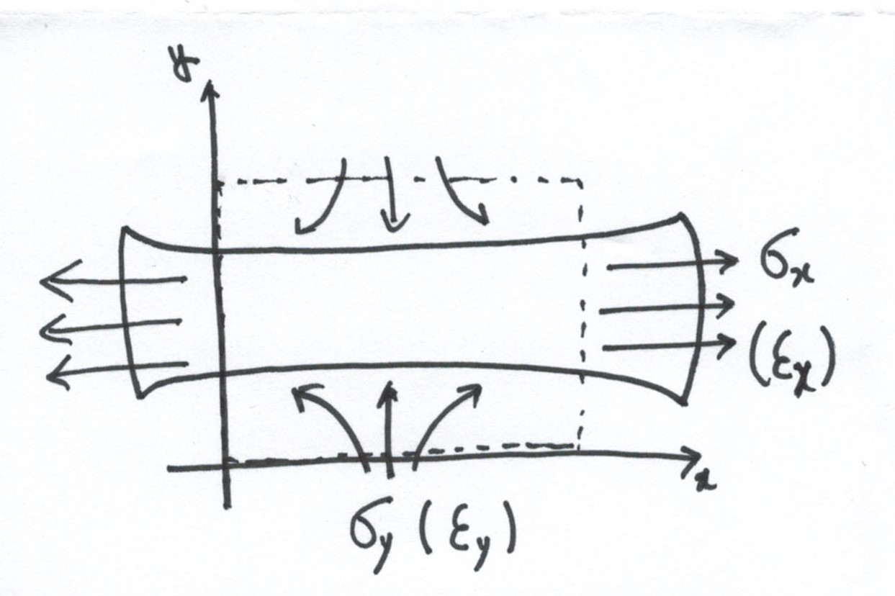
>
> $\therefore 0 \le \nu = -\frac{\epsilon_{y}\to (-)}{\epsilon_{x}} \le 1$이므로 항상 양(+)의 값이고, 1보다 작다.
> $$
> \sigma_{x} = E \cdot \epsilon_{x} \to \epsilon_{x} = \frac{\sigma_{x}}{E}\\
> \epsilon_{y} = -\epsilon_{x} \cdot \nu = -\frac{\nu}{E} \cdot \sigma_{x} \\
> $$
>
> $$
> \begin{pmatrix}
> \epsilon_{x}\\ \epsilon_{y}\\ \epsilon_{z}\\ \gamma_{xy}\\ \gamma_{yz}\\ \gamma_{zx}
> \end{pmatrix} = 
> \begin{bmatrix}
> \frac{1}{E} & -\frac{\nu}{E} & -\frac{\nu}{E} & 0 & 0 & 0\\
> -\frac{\nu}{E} & \frac{1}{E} & -\frac{\nu}{E} & 0 & 0 & 0\\
> -\frac{\nu}{E} & -\frac{\nu}{E}  & \frac{1}{E} & 0 & 0 & 0\\
> 0 & 0 & 0 & \frac{1}{G} & 0 & 0\\
> 0 & 0 & 0 & 0  & \frac{1}{G} & 0\\
> 0 & 0 & 0 & 0 & 0 & \frac{1}{G}\\
> \end{bmatrix} \begin{pmatrix}
> \sigma_{x}\\ \sigma_{y}\\ \sigma_{z}\\ \tau_{xy}\\ \tau_{yz}\\ \tau_{zx}
> \end{pmatrix}
> $$
>

> 2D인 경우, 3차원 중 하나의 차원을 제외시킨다.
>
> - plane stress
>
> 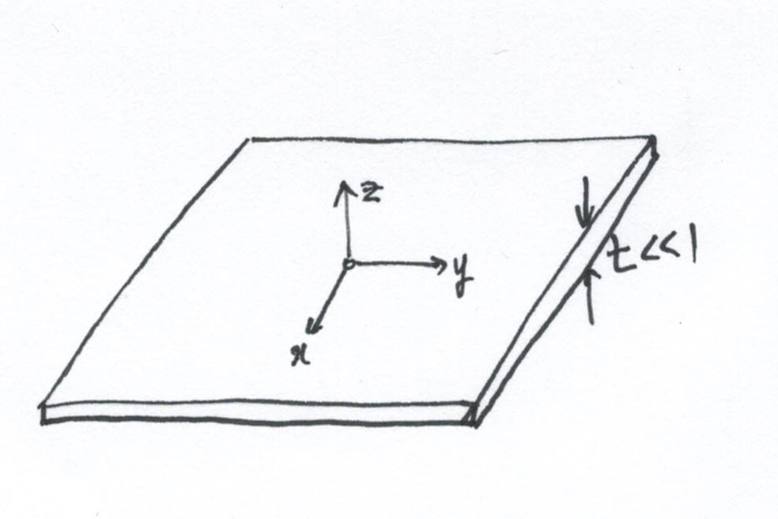
>
> 두깨방향의 성분을 무시($t \ll 1 \to \sigma_{z} \approx 0 $)
>
> $But, \epsilon_{z} \ne 0\quad !$
>
> - plane strain
>
> 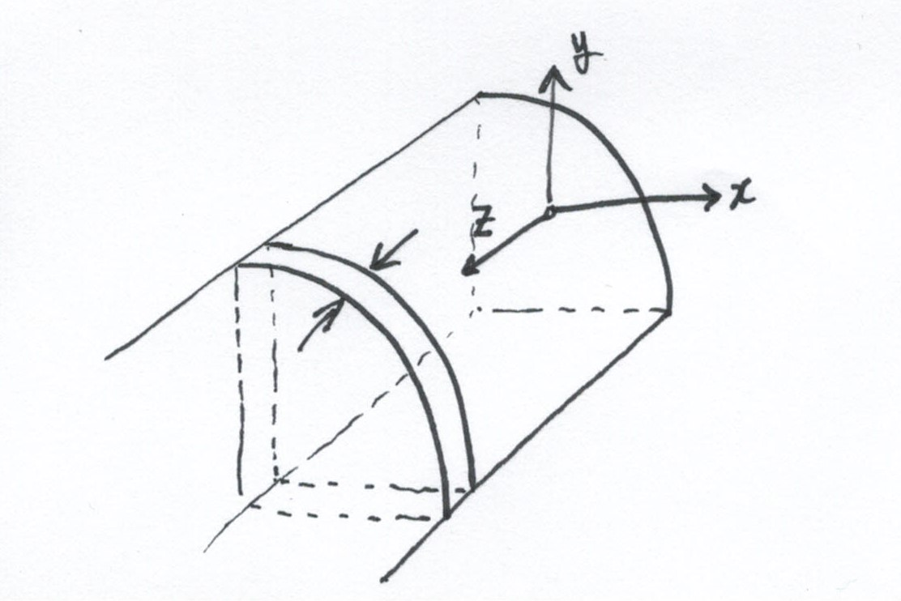
>
> 길이방향의 '변형'을 무시$(\epsilon_{z} \approx 0 $)
>
> $But, \sigma_{z} \ne 0\quad !$

## 좌표변환

- 내적$(dot\ product):$ $kronecker\ delta(scalar)$

$$
\vec{e_{i}}\cdot \vec{e_{j}} = \delta_{ij} =
\begin{cases}
0, & i \ne j \\
1, & i = j
\end{cases}
$$

- 외적$(coss\ product):$ $pummutation tensor(vector)$

$$
\vec{e_{i}}\times \vec{e_{j}} = \lVert \vec{e_{i}} \rVert \lVert \vec{e_{j}} \rVert \sin{(e_{i}, e_{j})} \vec{e_{k}} = \epsilon_{ijk} \vec{e_{k}} \quad ... \quad \epsilon_{ijk} = 
\begin{cases}
0, & i = j = k \\
1, & even\ order \\
-1, & odd\ order
\end{cases}
$$

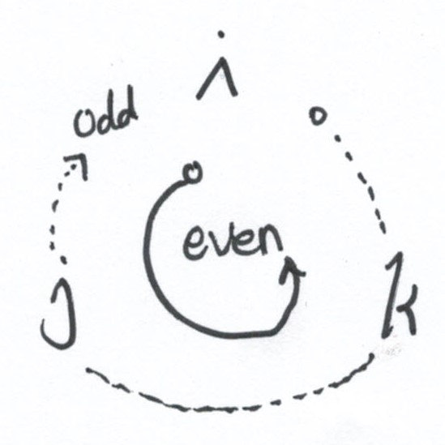

### 벡터$(1st-order\ tensor)$ 회전변환

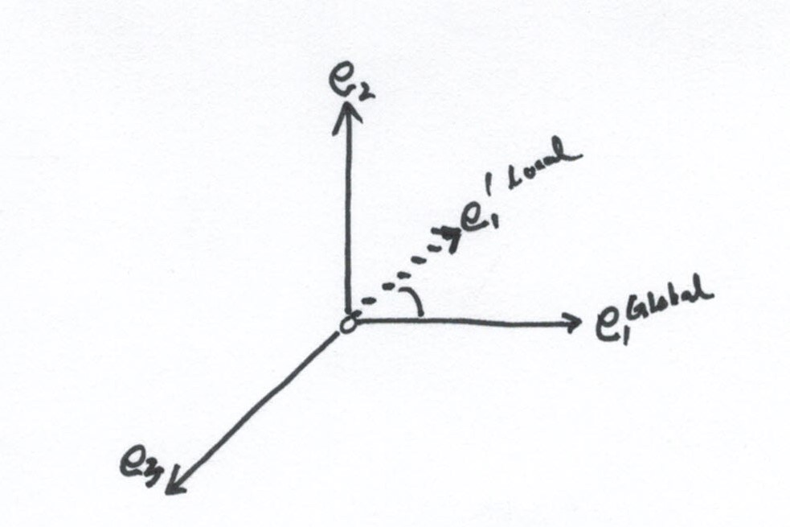

$$
a_{ij} = \vec{e_{i}^{\prime}}\cdot \vec{e_{j}} = \cos(\vec{e_{i}^{\prime}}, \vec{e_{j}})
$$
$proof)$
$$
\vec{e_{i}^{\prime}}\cdot \vec{e_{j}} = \lVert \vec{e_{i}^{\prime}} \rVert \lVert \vec{e_{j}} \rVert \cos{(\vec{e_{i}^{\prime}}, e_{j})}
$$
즉, $global(primed-coordinate)$ 좌표계와 $local(unprimed-coordinate)$ 좌표계의 사잇각을 이용해 단위 벡터 $\vec{e_{i}^{\prime}}$를 단위 벡터 $\vec{e_{j}}$로 나타낼 수 있다.
$$
\vec{e_{1}^{\prime}} = (\vec{e_{1}^{\prime}}\cdot \vec{e_{1}}) \vec{e_{1}} + (\vec{e_{1}^{\prime}}\cdot \vec{e_{2}}) \vec{e_{2}} + (\vec{e_{1}^{\prime}}\cdot \vec{e_{3}}) \vec{e_{3}}\\
\vec{e_{2}^{\prime}} = (\vec{e_{2}^{\prime}}\cdot \vec{e_{1}}) \vec{e_{1}} + (\vec{e_{2}^{\prime}}\cdot \vec{e_{2}}) \vec{e_{2}} + (\vec{e_{2}^{\prime}}\cdot \vec{e_{3}}) \vec{e_{3}}\\
\vec{e_{3}^{\prime}} = (\vec{e_{3}^{\prime}}\cdot \vec{e_{1}}) \vec{e_{1}} + (\vec{e_{3}^{\prime}}\cdot \vec{e_{2}}) \vec{e_{2}} + (\vec{e_{3}^{\prime}}\cdot \vec{e_{3}}) \vec{e_{3}}\\
$$

$$
\left( \vec{e_{i}^{\prime}} \right) = 
\begin{bmatrix}
\cos{(\vec{e_{1}^{\prime}}, e_{1})} & \cos{(\vec{e_{1}^{\prime}}, e_{2})} & \cos{(\vec{e_{1}^{\prime}}, e_{3})} \\
\cos{(\vec{e_{2}^{\prime}}, e_{1})} & \cos{(\vec{e_{2}^{\prime}}, e_{2})} & \cos{(\vec{e_{2}^{\prime}}, e_{3})} \\
\cos{(\vec{e_{3}^{\prime}}, e_{1})} & \cos{(\vec{e_{3}^{\prime}}, e_{2})} & \cos{(\vec{e_{3}^{\prime}}, e_{3})} \\
\end{bmatrix} \left( \vec{e_{j}} \right)
$$

$$
\therefore \left( \vec{e_{i}^{\prime}} \right) = \left[ \mathbf{a_{ij}} \right] \left( \vec{e_{j}} \right) \\
\left( \vec{e_{i}} \right) = \left[ \mathbf{a_{ji}} \right] \left( \vec{e_{j}^{\prime}} \right) \quad ... \quad \left[ \mathbf{a_{ji}} \right] = \left[ \mathbf{a_{ij}} \right]^{T}
$$

### 텐서$(2nd-order\ tensor)$ 회전변환

$$
\left[ \mathbf{K^{\prime}} \right] = \left[ \mathbf{A} \right] \left[ \mathbf{K} \right] \left[ \mathbf{A} \right]^{T} \\
\to \left[ \mathbf{K} \right] = \left[ \mathbf{A} \right]^{T} \left[ \mathbf{K^{\prime}} \right] \left[ \mathbf{A} \right]
$$

$proof)$
$$
\left[ \mathbf{K_{ij}}^{\prime} \right](\vec{e_{i}^{\prime}}\times \vec{e_{j}^{\prime}}) \equiv \left[ \mathbf{K_{pq}} \right](\vec{e_{p}}\times \vec{e_{q}}) \\
= \left[ \mathbf{K_{pq}} \right](\left[ \mathbf{A_{pm}} \right] \vec{e_{p}^{\prime}} \times \left[ \mathbf{A_{qn}} \right] \vec{e_{q}^{\prime}}) \\
= \left[ \mathbf{A_{pm}} \right] \left[ \mathbf{A_{qn}} \right] \left[ \mathbf{K_{pq}} \right]( \vec{e_{p}^{\prime}} \times  \vec{e_{q}^{\prime}})
$$
여기서 $p,q$와 $m,n$은 $dummy\ indices$이므로,
$$
\left[ \mathbf{K_{ij}}^{\prime} \right](\vec{e_{i}^{\prime}}\times \vec{e_{j}^{\prime}}) =
\left[ \mathbf{A_{ik}} \right] \left[ \mathbf{A_{jl}} \right] \left[ \mathbf{K_{ij}} \right]( \vec{e_{i}^{\prime}} \times  \vec{e_{j}^{\prime}}) \\
$$

$$
\left[ \mathbf{K_{ij}}^{\prime} \right] = \left[ \mathbf{A_{ik}} \right] \left[ \mathbf{A_{jl}} \right] \left[ \mathbf{K_{kl}} \right] \\
= \left[ \mathbf{A_{ik}} \right] \left[ \mathbf{K_{kl}} \right] \left[ \mathbf{A_{jl}} \right] \\
$$

$$
\therefore \left[ \mathbf{K^{\prime}} \right] = \left[ \mathbf{A} \right] \left[ \mathbf{K} \right] \left[ \mathbf{A} \right]^{T} \\
\to \left[ \mathbf{K} \right] = \left[ \mathbf{A} \right]^{T} \left[ \mathbf{K^{\prime}} \right] \left[ \mathbf{A} \right]
$$

---

# 단위 하중 법

