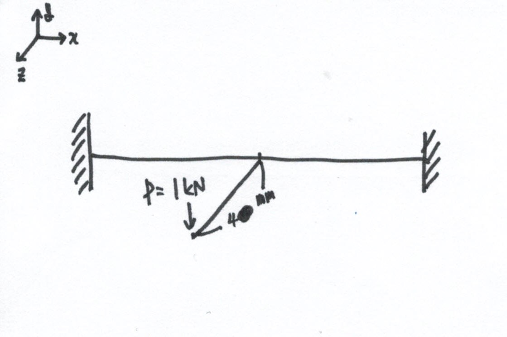
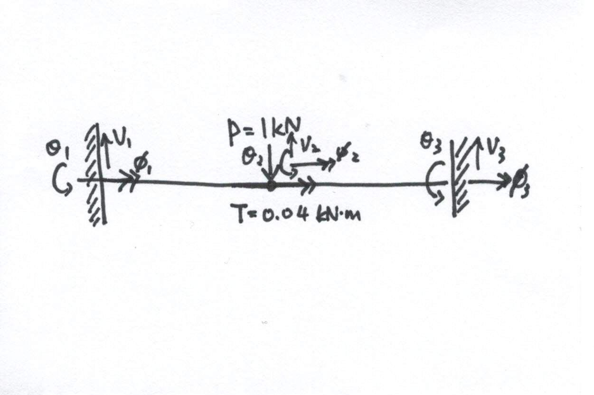
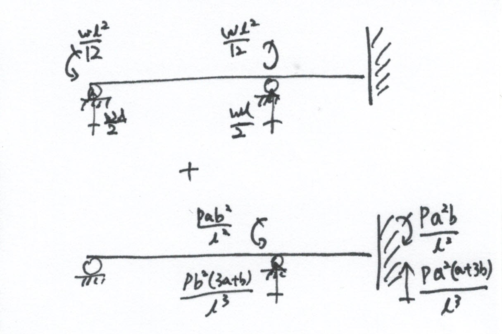
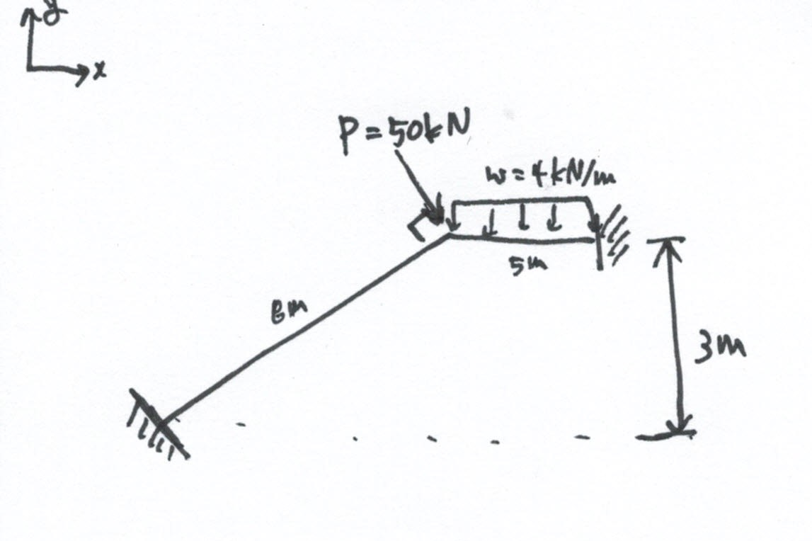
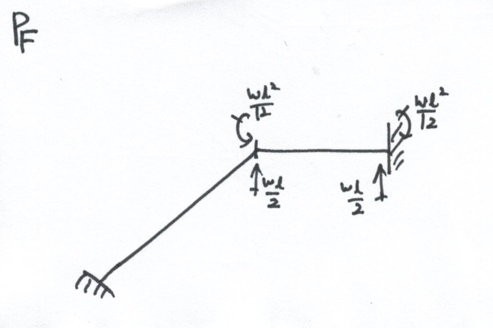

# 수업에 들어가기 전

> Implicit code: 정적인 구조 해석 용 코드, e.g. nastran
>
> Explicit code: 충돌이나 짧은 시간 내 이루어지는 변형을 해석하는 코드, e.g. LS-DYNA

# 문제 1) 'ㄱ' 빔

| Properies |        Element 1         |        Element 2         |
| :-------: | :----------------------: | :----------------------: |
|    $L$    |           $8m$           |           $5m$           |
|    $A$    |  $6\times10^{-3} m^{2}$  |  $4\times10^{-3} m^{2}$  |
|  $I_{z}$  | $200\times10^{-6} m^{4}$ | $50\times10^{-6} m^{4}$  |
|    $J$    | $300\times10^{-9} m^{4}$ | $100\times10^{-9} m^{4}$ |
|    $E$    |        $200 GPa$         |                          |
| $\gamma$  |          $0.3$           |                          |

$sol)$
$$
\begin{bmatrix}
\frac{EA}{L} &0&0&0&0&0&-\frac{EA}{L}&0&0&0&0&0 \\
0&0&0&0&0&0&0&0&0&0&0&0\\
0&0&0&0&0&0&0&0&0&0&0&0\\
0&0&0&\frac{GJ}{L}&0&0&0&0&0&-\frac{GJ}{L}&0&0\\
0&0&0&0&0&0&0&0&0&0&0&0\\
0&0&0&0&0&0&0&0&0&0&0&0\\
-\frac{EA}{L} &0&0&0&0&0&\frac{EA}{L}&0&0&0&0&0 \\
0&0&0&0&0&0&0&0&0&0&0&0\\
0&0&0&0&0&0&0&0&0&0&0&0\\
0&0&0&-\frac{GJ}{L}&0&0&0&0&0&\frac{GJ}{L}&0&0\\
0&0&0&0&0&0&0&0&0&0&0&0\\
0&0&0&0&0&0&0&0&0&0&0&0\\
\end{bmatrix}
$$
그리고, 평면에 대한 회전변환은 
$$
a_{ij} = e_{i}^{'}\cdot e_{j} = \cos(e_{i}^{'}, e_{j})
$$
로 나타낼 수 있다.

# 문제 2) 하중이 쉬어 중심에 작용하지 않는 빔

$sol)$

작용하는 하중을 쉬어 중심으로 가져오고 하중과 거리를 곱한 값으로 토션을 줘서 동치 상태로 만들어 준다.

# 문제 3) 분포하중이고, 노드 밖에 하중이 작용하는 빔

$sol)$

노달 포인트 외부에 존재하는 하중과 분포하중을 노드 위에 작용하는 하중으로 치환한다.

기존의 강성행렬 식에서 fixed end 외력 항이 추가되어 아래와 같다.
$$
\left( P \right) = \left[ K \right]\left( D \right) \to \left( P \right) = \left[ K \right]\left( D \right) + \left( P_{f} \right)
$$
즉, 강성행렬을 벤딩에 의한 처짐과 처짐각 변화를 행렬과 곱하고, 노달 포인트 밖의 하중과 분포하중을 각각 노달 포인트 상에 작용하는 하중으로 변화시켜 외력 행렬로 나타내 더한다.
$$
\begin{pmatrix} V_{1}\\ M_{1}\\ V_{2}\\ M_{2}\\ V_{3}\\ M_{3}\\ \end{pmatrix} 
= \begin{bmatrix}
\\
\\
K\\
\\
\\
\\
\end{bmatrix}
\begin{pmatrix} v_{1}\\ \theta_{1}\\v_{2}\\ \theta_{2}\\v_{3}\\ \theta_{3}\\ \end{pmatrix} 
+
\begin{pmatrix}
\frac{\omega l}{2}\\
\frac{\omega l^{2}}{12}\\
\frac{\omega l}{2} + \frac{Pb^{2}(3a+b)}{l^3}\\
-\frac{\omega l^{2}}{12} + \frac{Pab^2}{l^2}\\
-\frac{Pa^{2}(a+3b)}{l^3}\\
\frac{Pa^2b}{l^2}\\
\end{pmatrix}
$$

# 문제 4) 꺽인 빔

$sol)$

$$
\begin{pmatrix} P_{1}\\V_{1}\\ M_{1}\\ {3 \over 8}P\\-{\sqrt{55} \over 8}P\\ M_{2}\\ P_{3}\\V_{3}\\ M_{3}\\ \end{pmatrix} 
= \begin{bmatrix}
\\
\\
K\\
\\
\\
\\
\end{bmatrix}
\begin{pmatrix} u_{1}\\v_{1}\\ \theta_{1}\\u_{2}\\v_{2}\\ \theta_{2}\\u_{3}\\v_{3}\\ \theta_{3}\\ \end{pmatrix} 
+
\begin{pmatrix} 0\\0\\0\\ 0\\\frac{\omega l}{2}\\ \frac{\omega l^{2}}{12}\\ 0\\\frac{\omega l}{2}\\ -\frac{\omega l^{2}}{12}\\ \end{pmatrix}
$$
